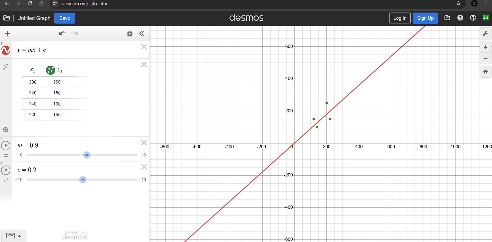

# Linear Regression in Machine Learning

Linear Regression is a supervised learning algorithm in Machine Learning.

- It is mainly used for regression problems, to predict a continuous output(like price, salary).
- It shows the relationship between independent variables and dependent variables.

## Simple Linear Regression(one feature):

                Y = mX + c

where:

- Y: Predicted value (dependent variable)
- X: Input feature (independent variable)
- m: Weight
- c: Bias
  

## Multiple Linear Regression(many features):

                Y = w1x1 + w2x2 + ... + wnxn + b

where:

- x1, x2, .., xn: Input features
- w1, w2, .., wn: Weights
- b: Bias

## How it works:

1. Training Data: Collect dataset with input features(X) and output labels(Y).
2. Model Fitting: The algorithm determines the best line/ hyperplane by minimizing the error between predicted and actual values.
- Error is measured using Mean Squared Error(MSE)
3. Optimization: Uses methods like Gradient Descent to adjust weights and bias to minimize error.
4. Prediction: After training, the model can predict output to new inputs.

## Applications of Linear Regression

- House price prediction
- Sales prediction
